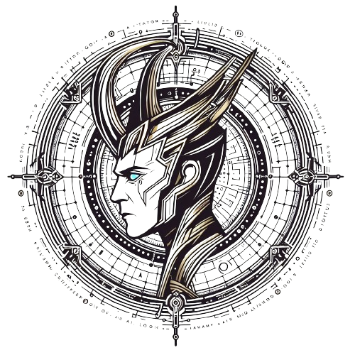

# Proyecto Loki 🎙️

Este es el proyecto Loki, una aplicación de reconocimiento de voz.

## Pasos completados ✅

Aquí están los pasos que hemos completado hasta ahora:

- [x] Configuración inicial del proyecto 🚀
- [x] Creación de la interfaz de usuario 🖥️
- [x] Pruebas y depuración 🐞

## Próximos pasos 🚧

Estos son los próximos pasos que planeamos tomar:

- [ ] Conversión de audios a texto 📝
- [ ] Implementación del reconocimiento de voz 🎤
- [ ] Mejorar la precisión del reconocimiento de voz 🎯
- [ ] Añadir más idiomas 🌍
- [ ] Optimizar el rendimiento de la aplicación ⚡

Gracias por visitar nuestro proyecto! 😊

## Creado por

Boolean/Bit 👨‍💻